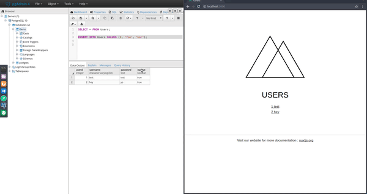

# CPSC304

### Setup Instructions for Linux

    Identical to the instructions for Windows, with one exception:
    1. Node.js doesn't have an installer for Linux. Download and extract the tar.gz file.
        - Make sure to add bin/ in the extracted folder to PATH

### Setup Instructions for Mac
    
    Identical to the instructions for Windows, with a few exceptions:
    0. [Optional] Install `homebrew`
        - Homebrew is a package manager for MacOS
    1. When installing postgres via GUI installer
        - The bin/ folder is not added to PATH automatically
        - The bin path should be /Library/PostgreSQL/<version>/bin
        - Alternatively you can try `brew install postgresql`, but there are problems with XCode
    2. When installing node
        - Simply run `brew install node`
        - Or download the pkg installer for Mac

### Setup Instructions for Windows

    1. Install Postgres using the GUI installer
        - https://www.postgresql.org/
        - Choose all default options
        - When prompt for password, enter `postgres`
    2. Setup the database locally
        - Use pgAdmin to access postgres graphically
        - Right-click on Databases node, and create a database called `Demo`
        - Right-click on the new `Demo` node and select `Query Tool`
        - This will bring up a place where you can execute SQL statements
        - Copy-paste dbscripts/CreateUsersTable.sql and execute 
        - This will create a `Users` table and insert two fake users
        - Verify by running SELECT * FROM Users
    3. Install Node.js using the GUI installer
        - https://nodejs.org/en/
        - Choose the latest version, which should be v8.7.0
        - Choose all default options
    4. [Optional] Install `vue-cli`
        - https://github.com/vuejs/vue
        - Vue-cli is a npm module which allows you to quickly get started with vue
        - In PowerShell run `npm install -g vue-cli`
        - The -g option says that the module will be installed globally 
    5. Clone starter code from https://github.com/belinghy/cpsc304.git
        - Uses `nuxt-express` template internally
        - Nuxt.js is a module built on top of Vue.js
        - It takes care of a lot of the mechanical web dev exercises, like routing
    6. Run `npm install` in demoui/
        - This will install all the dependencies defined in `packages.json`
        - `packages.json` also defines other useful commands, basic info, etc
    7. Run `npm run dev` in demoui/
        - This will start the server
        - You should be able to see the webapp at http://localhost:3000
        - You should see the two fake users displayed on the main screen
